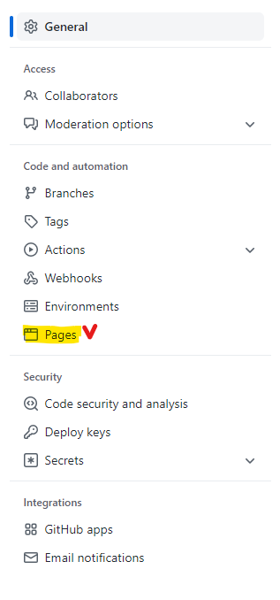
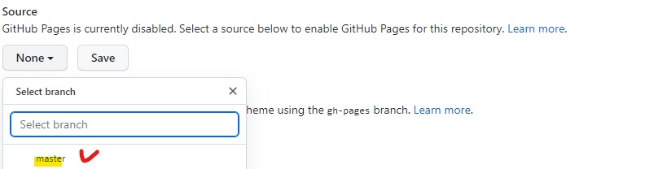
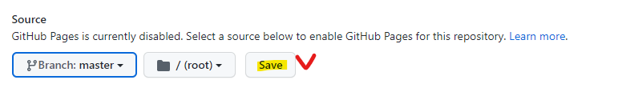
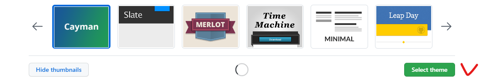
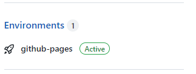
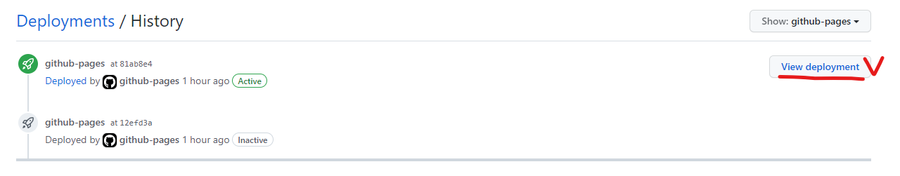

# 배포 방법 (1)깃허브io

 `#github.io` `#리포지터리에서` `#배포방법` 

1. 내가 배포하고 싶은 리포지터리에 들어가서 `Settings`를 누른다
   

2. `Pages`를 클릭

   

3. 화면에서 Source를`None`에서 고르고 싶은 branch 선택
   * `master`고른 후 ➡️ save

4. Theme Chooser에서 Jekll theme 골라 `select theme `클릭

수정 관련 더 자세한 내용은 여기참고➡️ [Theme Chooser](https://docs.github.com/en/pages/getting-started-with-github-pages/adding-a-theme-to-your-github-pages-site-with-the-theme-chooser)

5. 리포지터리 우측에 새로 생긴 `Environments`에서 `github-pages` 클릭하고 ➡️ view deployment하면 볼 수 있다!

