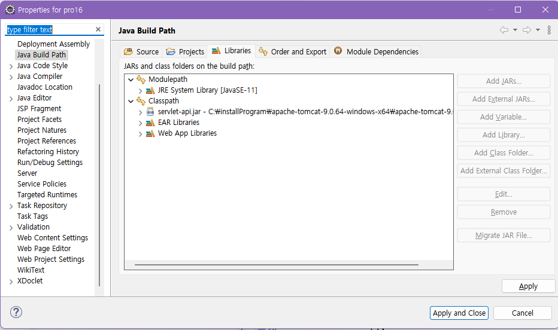
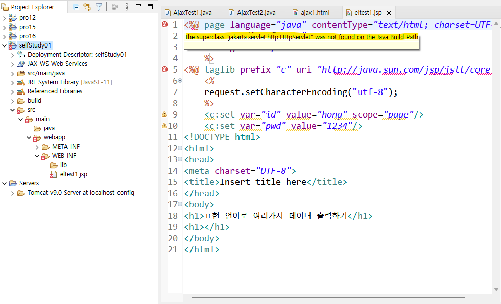
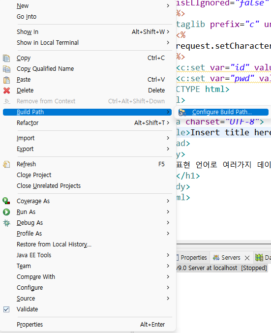
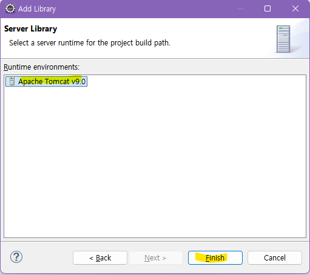
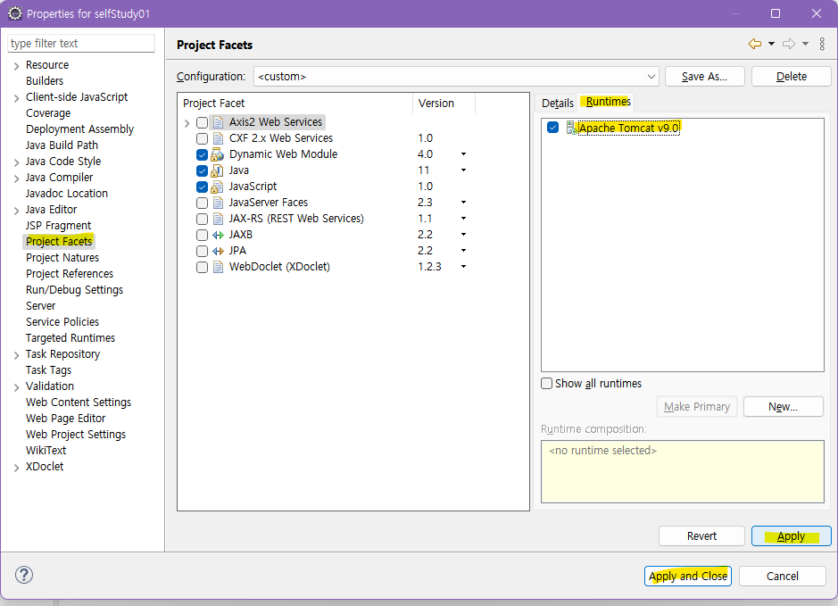
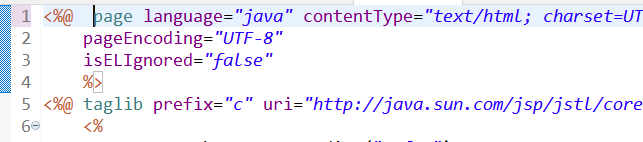

# HOW TO SOLVE jakarta.servlet error

### The superclass "jakarta.servlet.http.HttpServlet" was not found on the Java Build Path

- jsp 공부 중..

- 분명 [Classpath] ➡️ [Add External JARs..] ➡️ servlet-api.jar 선택 ➡️ apply 해줬는데도 jsp 파일에 에러 발생
  

- `The superclass "jakarta.servlet.http.HttpServlet" was not found on the Java Build Path`

  

- 구글링 결과

- [JSP 파일 생성 직후 에러(The superclass "javax.servlet.http.HttpServlet" was not found on the Java Build Path)](https://hongeui.tistory.com/13)

  - JSP 파일 생성 직후 생기는 에러

- [The superclass "jakarta.servlet.http.HttpServlet" was not found on the Java Build Path](https://upself.tistory.com/18)

  - 경로를 찾지 못해서 발생

### 해결

#### 1. 라이브러리 추가해주기

- 에러난 project 우클릭 ➡️ Build Path ➡️ Configure Build Path

- Java Build Path ➡️ Libraries ➡️ Modulepath ➡️ Add library ➡️ ServerRuntime ➡️ Next

- Apache Tomcat v9.0 (자신이 다운 받은 버젼) 클릭 ➡️ Finish ➡️ Apply and Close

#### 2. Project Facets 런타임에 아파치 추가해주기

- Project Facets ➡️ Runtimes > Apache Tomcat v9.0 (자신의 아파치 버전) ➡️ Apply and Close

- 이렇게 해줘도 오류가 발생하는 경우가 간혹 있다고 했는데 위의 과정에 추가했던 거를 삭제하고 반복해도 오류가 난다면
- 단순히 이클립스가 인식을 안해줘서 그런거라서 잠깐 스페이스바를 눌러 주고 저장을 하면 해결!

