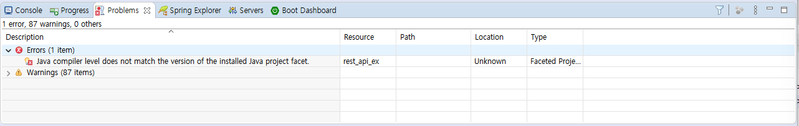
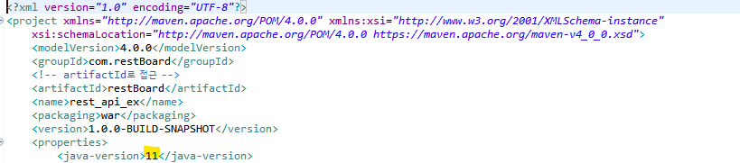
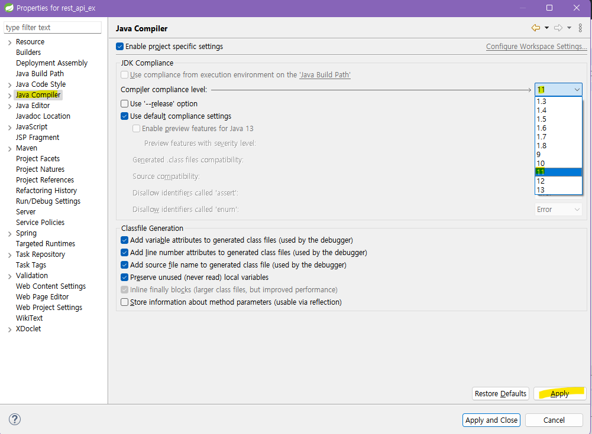
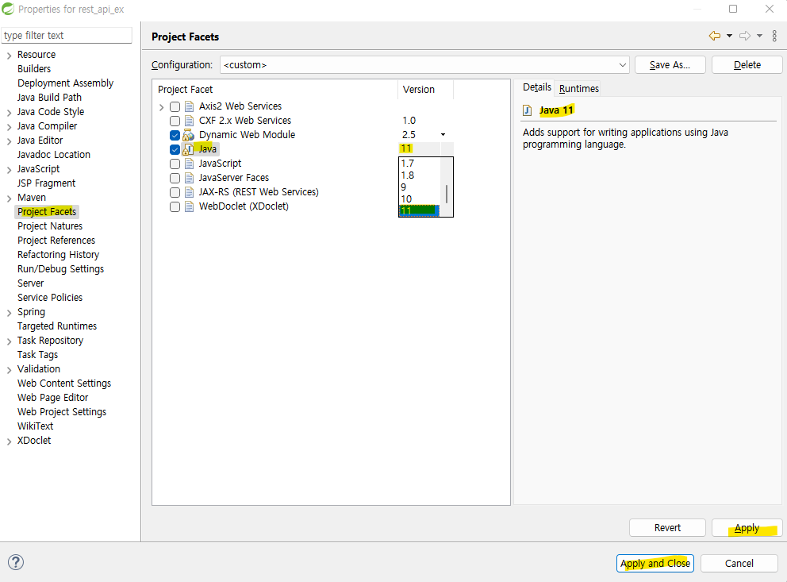

# 📋 HOW TO SOLVE Java compiler level and Java project facet mismatch

* Dao 코드 작성중 
```java
  public UserVo getUserByUserId(String userId) {
  	return users
  			.stream()
  			.filter(user -> user.getUserId().equals(userId))
  			.findAny()
  			.orElse(new UserVo(-1,"","",""))
  			;
  }
```

* 람다식을 쓰려고 했지만 1.8이상부터 사용가능해서 compiler level을 높였더니 패키지에서는 오류가 있지만 어떠한 코드에서도 오류가 뜨지 않아서 `Problems`을 확인해보니



`Java compiler level does not match the version of the installed Java project facet`

에러가 발생 ➡️ 구글링해보니 컴파일러 레벨을 현재 자바 버젼과 맞춰줘야하는 것 같았다



* 해결방법



1. 작업중인 프로젝트 우클릭 ➡️Java Compiler➡️compiler compliance level➡️Apply️



2. Project Facets ➡️Java : 11➡️Apply and Close

* 해결~
* 만약 JRE와 환경변수 등이 11과 맞지 않은 상황이라면 아래까지 참고할 것
  * [참고](https://www.codejava.net/ides/eclipse/change-java-compiler-version-for-eclipse-project)