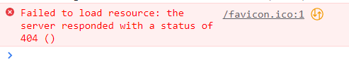
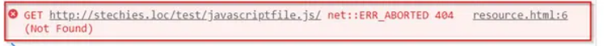

# HOW TO SOLVE

### Failed to load resource: the server responded with a status of 404 (Not Found)



- 자바스크립트 공부 중 console창에 계속 이 메세지가 떠서 거슬렸음

- 해결책 구글링

  - [참고한블로그1](https://www.stechies.com/failed-load-resource/#:~:text=The%20only%20way%20to%20fix,instead%20of%20a%20relative%20URL.) ➡️css,js 효과가 잘 들어감.

    - net::ERR_ABORTED 오류도 아니라서 해당사항 아님

    

  * [참고한블로그2](https://aneok.tistory.com/99)

    - 원인은 단순하게 `상단에 주소 부분에 아이콘이 없어서 이런 문구가 나오는 것`
    - head안에 아래를 추가하면 해결!

```html
<link rel="shortcut icon" href="/favicon.ico" type="image/x-icon" />
<link rel="icon" href="/favicon.ico" type="image/x-icon" />
```
