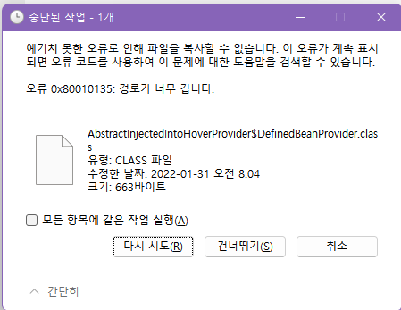

# 📋 How to fix Error 0x80010135

`Error 0x80010135 ` `경로가 너무 깁니다`

- 스프링부트 4버전으로 업그레이드하기 위해 zip파일 푸는데 경로에서 계속 오류가 발생
- ` 오류 0x80010135 경로가 너무 깁니다`

- 원인

  - 거의 모든 컴퓨터 사용자가 [복사 문제](http://windowsbulletin.com/ko/복사-방지-오류-0x80030309-해결-된-Windows-해결/), 파일 이름이 너무 김, 지울 수 없음, 액세스 거부 또는 대상 경로가 너무 김과 같은 메시지 중 하나가있는 파일을 삭제하거나 이름을 바꿉니다.
    - Windows / FAR가 `256 자`보다 긴 경로 이름을 복사, 삭제 또는 이름을 바꿀 수 없기 때문에 발생
    - 7-Zip과 같은 압축 풀기 프로그램을 사용
    - `파일을 루트 디렉토리 또는 c : / temp에 추출`

- 해결

  - 이미 압축 풀기 프로그램을 쓰고 있는데도 오류발생했으므로
  - 설치 프로그램을 모아둔 경로 대신
  - `파일을 루트 디렉토리 또는 c : / temp에 추출`하기로 함

- [참고] [오류 0x80010135 수정 방법 : 경로가 너무 깁니다.](http://windowsbulletin.com/ko/how-to-fix-error-0x80010135-path-too-long/)

- 😅TMI😅 Gradle build가 계속 오류나서 곤란했는데 당연히 설치할때 건너뛰고 설치했으니 build 할 방법이 없지..
  - 😅TMI😅 설치프로그램들 모아둔 경로로 바꿀려고 했는데 한참 걸려서 그냥 포기..ㅎㅎ
