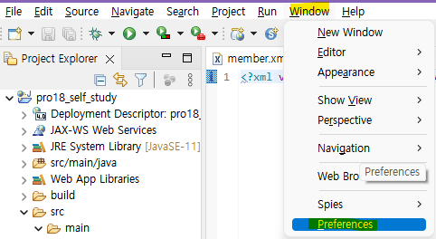
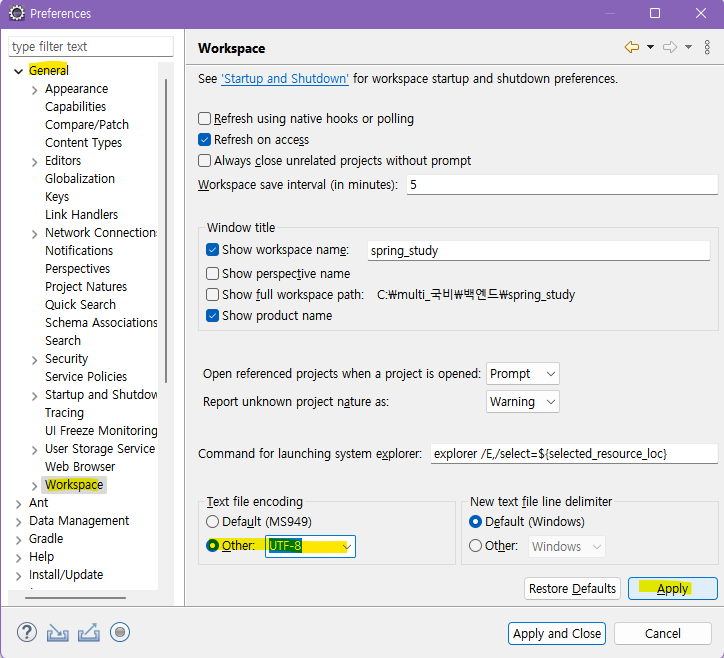
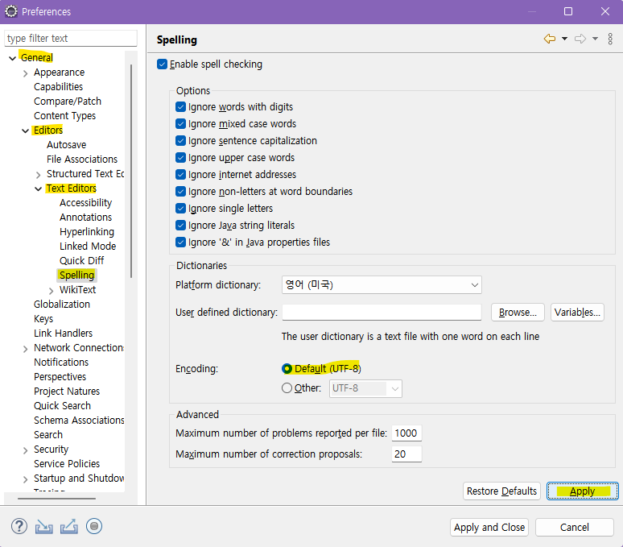
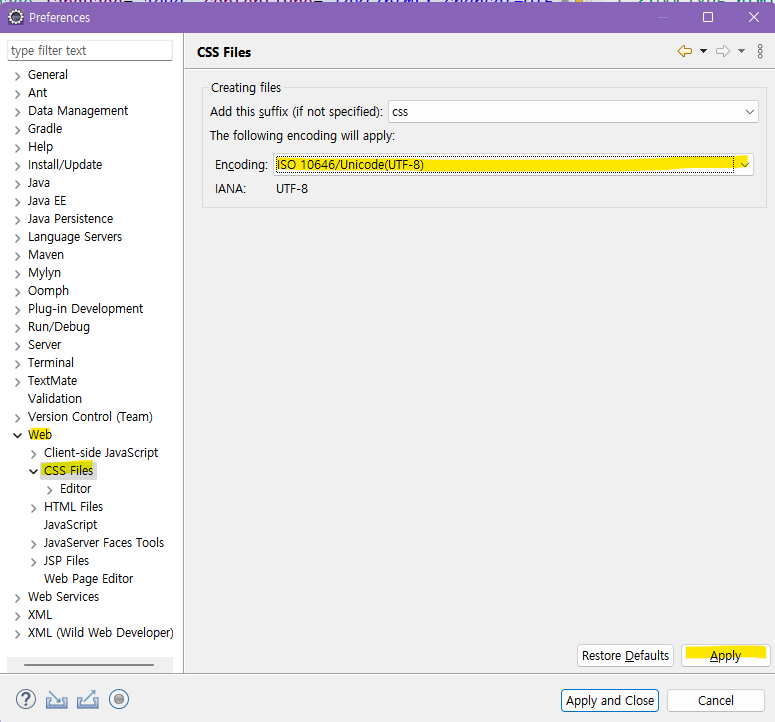
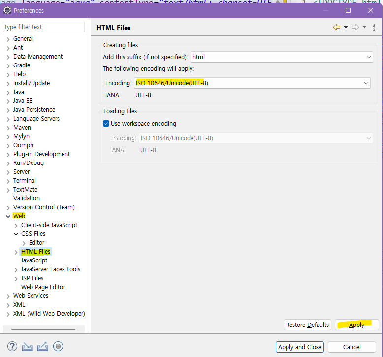
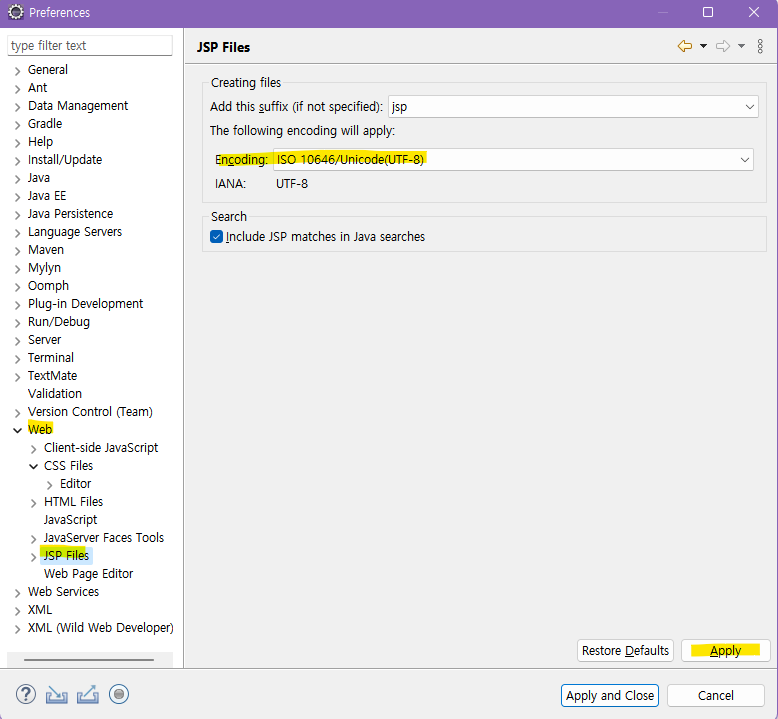
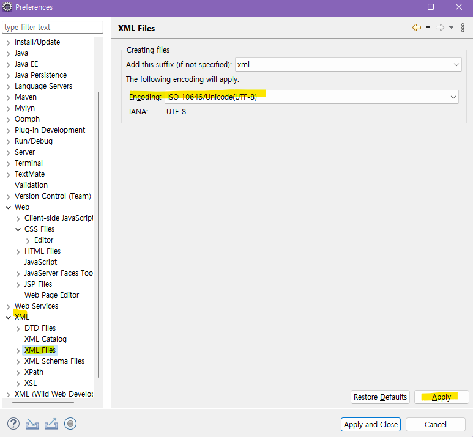
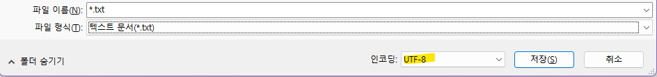

# 📋HOW TO ENCODE: eclipse UTF-8 for Java

*  개발공부를 시작한 입장에서 이클립스에서 한글깨짐이 발생하면 곤란했음
* 매번 구글링을 하기 번거러워서 이참에 정리함 
* 참고 
  * [이클립스(Eclipse)한글 깨짐 -"UTF-8"인코딩 설정](https://suzxc2468.tistory.com/174)
  * [HTML, jSP에서 한글 깨짐- 인코딩 설정](https://suzxc2468.tistory.com/180)
  * [인코딩 방식](https://ofcourse.kr/html-course/%EC%9D%B8%EC%BD%94%EB%94%A9)

* 방법: java 클래스 파일, workspace, spelling, css file, html file, jsp file, xml file 각각 설정해주기

  1. `Window` ➡️`Preferences`

  

  2. `Preferences` ➡️`General`➡️`Content Types`➡️`Java Class File`➡️`Default encoding`➡️`UTF-8`으로 설정 ➡️`Update`

 

3. `Preferences` ➡️`General`➡️`Workspace`➡️`Other: UTF-8`으로 설정 ➡️`Apply`



3. `Preferences` ➡️`General`➡️`Editors`➡️`Text Editors`➡️`Spelling`➡️`Encoding`➡️`Default: UTF-8`으로 설정 ➡️`Apply`



4. `Preferences` ➡️`Web`➡️`Css Files`➡️`Encoding` :` ISO 10646/Unicode(UTF-8)`으로 설정 ➡️`Apply`



5. `Preferences` ➡️`Web`➡️`HTML Files`➡️`Encoding` :` ISO 10646/Unicode(UTF-8)`으로 설정 ➡️`Apply`



6. `Preferences` ➡️`Web`➡️`JSP Files`➡️`Encoding `: ` ISO 10646/Unicode(UTF-8)`으로 설정 ➡️`Apply`



7. `Preferences` ➡️`Web`➡️`XML Files`➡️`Encoding `: ` ISO 10646/Unicode(UTF-8)`으로 설정 ➡️`Apply`



---

* HTML
```html
<head>
    <meta charset="utf-8"> <!--헤드 안으로 삽입-->
</head>

```

* XHTML

```xml
<head>
    <meta http-equiv="Content-Type" content="text/html; charset=utf-8" />
</head>
```

* JSP

```jsp
<%@ page language="java" contentType="text/html; charset=UTF-8" pageEncoding="UTF-8"%>
```

* 메모장 (저장 전 인코딩 드롭박스에서 설정)


