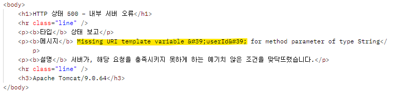
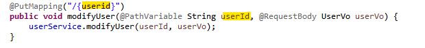

# 📋How-to-solve-missing-URI-template-variable-for-method-parameter-of-type-String

* RestAPI 공부중 어노테이션으로  GET/POST/PUT/DELETE 공부중
* postman에서 이런 에러가 발생했다

* 구글링 결과 ➡️ 컨트롤러에서 URI 템플릿에 해당하는 변수명이나 타입이 안맞음
  * [참고1](https://eugene-kim.tistory.com/98)

* 해결방안 ➡️ URI 탬플릿 `"{변수}"`와 `@PathVariable 변수명` 동일하게 맞춰주기
  * `"/{userid}"` ➡️`"/{userId}"`로 변경해줬더니 간단히 해결!

