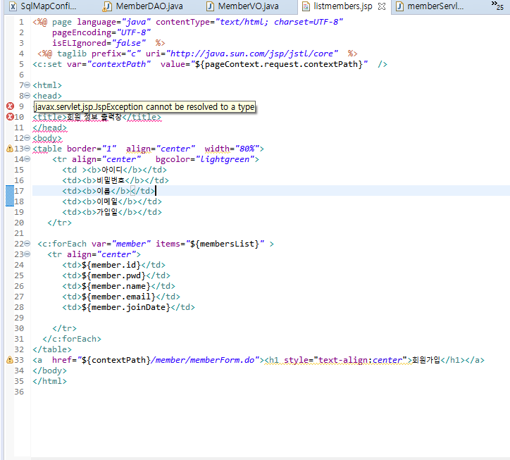

# 📋HOW-TO Solve taglibs error

`javax.servlet.jsp.JspException cannot be resolved to a type`

- 해결방법은 생각보다 간단했음!



- [해결법](https://aljjabaegi.tistory.com/187)
- 작업중인 프로젝트 우클릭 ➡️Properties➡️Project Facets➡️Runtimes➡️Apache Tomcat v9.0➡️Apply and Close


- 해결!

- [기타 사항들]

  - `원인이 이거다!` 싶은 설명을 찾기 어려워서 문제 발생지점인 project Facets의 역할을 정리해봄[Project Facets_IBM](https://www.ibm.com/docs/en/radfws/9.6?topic=SSRTLW_9.6.0/com.ibm.javaee.doc/topics/cfacets.html)

    - ```
      Facets define characteristics and requirements for Java™ EE projects and are used as part of the runtime configuration.

      When you add a facet to a project, that project is configured to perform a certain task, fulfill certain requirements, or have certain characteristics. For example, the EAR facet sets up a project to function as an enterprise application by adding a deployment descriptor and setting up the project's class path.

      ```

    - 즉 런타임 시 프로젝트가 갖는 특징이나 task, 조건들을 정의해주는데 명시적으로 하지 않아서 그런 듯한 에러 같다

      - 😅TMI😅 실제로 tomcat 버젼과 project facet의 톰캣 버젼이 달라서 에러가 발생하는 사례도 있으니..

  - 비슷한 류의 서블릿 에러가 난다면 참고해 보기

  - [The import javax.servlet cannot be resolved 에러 해결 방법](https://atoz-develop.tistory.com/entry/The-import-javaxservlet-cannot-be-resolved-%EC%97%90%EB%9F%AC-%ED%95%B4%EA%B2%B0-%EB%B0%A9%EB%B2%95)

    - 😅TMI😅 아마 다른 에러들이 안난 거는 buildpath에 tomcat을 이미 추가해줘서 그런듯함
