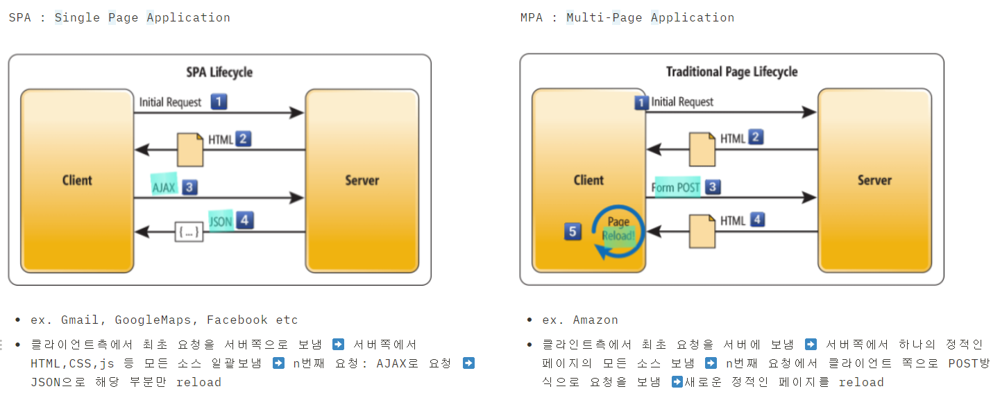
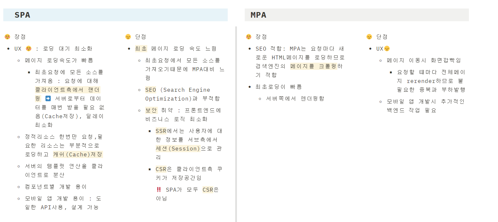

# 📋 SINGLE PAGE APPLICATION VS MULTI-PAGE APPLICATION

`SPA` 		`MPA`		 `pros&cons` 		`SEO`	

`CSR` 		`SSR` 	

`Cache`   		`Session`		 `Cookie`

 `Ajax`	

`Information Architecture`

`Cross-site scripting attacks XSS `

### 1. SPA? MPA? 차이는 `로딩방식`

### 2. SPA MPA 장단점 비교 정리

### 3. SEO (Server Engine Optimization)?

$$내용추가하기~~~~

### 4. SPA? MPA? 선택 시 고려 사항

* `Continuation of Approach`
  * 요청 전후 페이지가 동일해야할 필요성이 적을 떄 ➡️ MPA
    * ex. eCommerce : Amazon에서 상품을 보거나 분류를 볼 떄 굳이 동일한 페이지를 유지할 필요는 없음
* `SEO (Search Engine Optimization)` 검색엔진에 노출이 우선순위에 해당된다면 ➡️ SPA보다는 MPA
  * ex. Facebook은 콘텐츠가 많지만 구글링을 하면 콘텐츠 자체에 대한 검색결과는 막상 없음
* `UX (User Experience)`
  * SPA : 연속성, 모바일앱에 적합, 접근용이성이 목표라면...
  * MPA :  정보 아키텍쳐 최적화가 목표라면...
* `Security & Vulnerabilities`
  * SPA가 MPA보다 취약함
    * Cross-site scripting attacks XSS 에  더 취약함

  * SPA는 최초 페이지 로딩 중 원하지 않은 데이터가 노출되지 않도록 각별히 주의해야함

* Scalability
  * $$내용추가하기~~~~

### 5. SPA의 단점 보안 방법

* 참고 사이트
  * [SPAvsMPA_figure](https://docs.microsoft.com/en-us/archive/msdn-magazine/2013/november/asp-net-single-page-applications-build-modern-responsive-web-apps-with-asp-net)
  
  * [SINGLE PAGE APPLICATION (SPA) VS. MULTI-PAGE APPLICATION (MPA) – WHICH ONE IS THE BEST IN 2022](https://www.tekrevol.com/blogs/spa-vs-mpa/#:~:text=Differences%20Between%20SPA%20and%20MPA,SPAs%20generally%20rely%20on%20JavaScript.)
  
  * [SPA기반 웹사이트의 SEO](https://www.ascentkorea.com/seo-for-spa/)
  
  * [SPA_MPA_장단점__뜻정리](https://hanamon.kr/spa-mpa-ssr-csr-%EC%9E%A5%EB%8B%A8%EC%A0%90-%EB%9C%BB%EC%A0%95%EB%A6%AC/)
  
    

