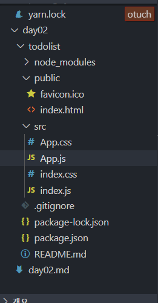
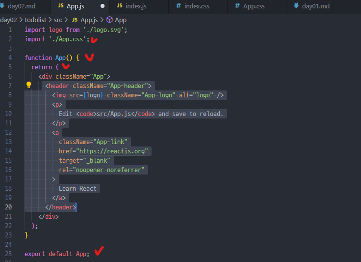
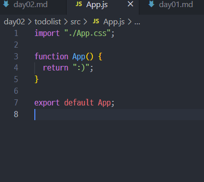
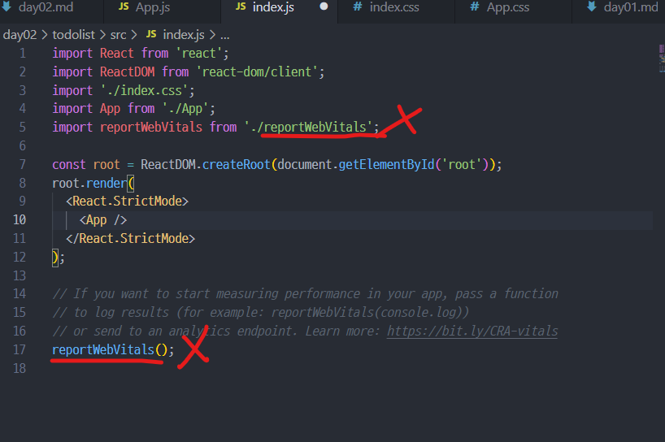
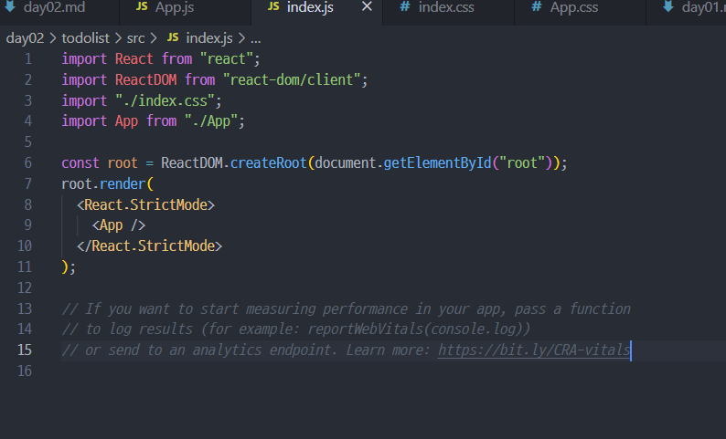
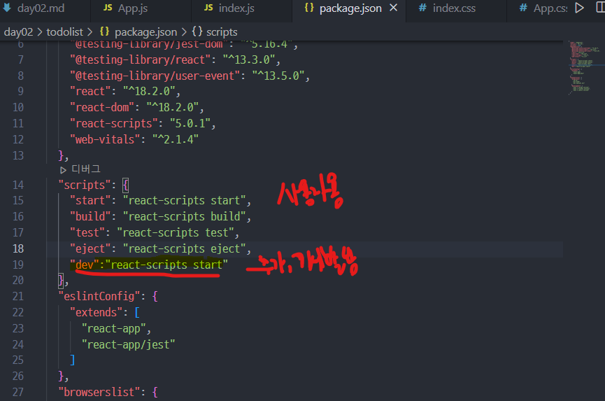
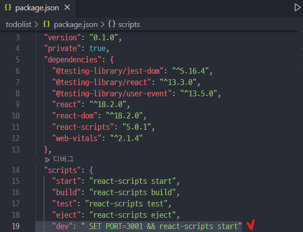

# 📋Getting started with React

- [React](https://reactjs.org/)

## 1. 리액트란?

- 자바스크립트 라이브러리
  - 라이브러리? API? 프레임워크?
- 리액트 DOM은 element과 자식들을 이전의 것과 비교해서 `필요한 부분만` 지향하는 상태로 업데이트함

---

## 2. 리액트 관련 개념

- Components?

​ = 구성요소 ➡️ UI를 독립적이고 재사용한 개별적 부분으로 나눠주게 함

- Render?

- 바벨?

- 웹팩?

- JSX란?

  - JSX = JavaScript XML

    - Extension to Javascript Syntax

    - Creates React "elements"

      - element= 리액트 App의 가장 작은 가변적이지 않은 단위 ([immutable](https://en.wikipedia.org/wiki/Immutable_object))
        - immutable = 한번 생성하면 자식이나 속성을 바꿔줄 수 없음
        - 업데이트 방법?
          - 새 element 만들고 `root.render()` 해주기 (대부분의 모든 React app에서는 한번만 호출함..)

    - 랜더링 전에 String으로 모두 바뀌어서 Injection Attack([cross-site-scripting](https://en.wikipedia.org/wiki/Cross-site_scripting))예방

    - React DOM은 통상적으로 camelCase로

    - How it looks like..변수인데? Html 태그?

    - ```jsx
      const element = <h1>Hello, world!</h1>;
      const food = "Pizza";
      const element2 = <h1>I love {food}!</h1>;
      ```

    - 사실 { }안에는 위의 예시와 같이 변수뿐만 아니라 다양한 것(자바스크립트 문법에 맞는 거라면)들이 들어갈 수 있다

      - Json

        ```jsx
        const menu = {
            menuName='Pizza',
            menuType='fastfood'
        };
        ```

      - function

        ```jsx
        function formatFood(menu) {
          return `${menu.MenuName} is my favourite ${menu.menuType}`;
        }
        ```

    - 즉, JSX를 조건문 반복문, 변수에 넣거나 함수의 리턴값으로도 받을 수 있다

      ```jsx
      const element =(
      <h1>
          {formatFood(menu)!Yumm!}
      </h1>
      );
      ```

      - ```jsx
        function formatFood(menu) {
          return `${menu.menuName} is my favourite ${menu.menuType}`;
        }

        const menu = {
          menuName: "Pizza",
          menuType: "fastfood",
        };

        const element = <h1>{formatFood(menu)}! Yumm!</h1>;

        const root = ReactDOM.createRoot(document.getElementById("root"));
        // root.render(formatFood(menu));	//Pizza is my favourite fastfood
        root.render(element); //Pizza is my favourite fastfood! Yumm!
        ```

  - 속성주기
    - `" "` (String 값)또는 `{ }`(표현식)로 감싸주기 (반드시 둘 중 하나로만)
      - `const element = <a href="http://example.com">link</a>;`
      - `const element = ;`

---

## 3. 리액트 프로젝트 생성하기 `CRA`

- `npx create-react-app 프로젝트명`
- 바벨, 웹팩을 설정하지 않아도 기본 패키지에 포함돼서 옴
- 리액트 공부를 시작한 입장이므로 기본 setting에 관해서 정리해둠

1. 불필요한 것들 모두 제거하기



2. public ➡️public➡️`favicon.ico` 와 `index.html`만 남기고 다 지우기

3. src➡️`App.css`, `App.js`, `index.css`, `index.js`만 남기고 지워버리기
4. App.js에서 남겨둘 것

- `function App(){return":)"};`
- `export default App;`





5. index.js에서 남겨둘 것

- 전의 제거해준 reportWebVitals관련된 거 제거하기





6. index.css와 App.css에는 안의 내용을 다 제거하기

- npm i

  - node_modules가 없는 상태로 전달 될 것

  - git에 있는 것을 clone 받아도 마찬가지 (너무 용량이 크기 때문)

  - package.json
    - dependencies
      - 설치 되어 이쓴 라이브러리들의 키 값
      - nodes_modules 폴더에 라이브러리들이 설치되어있는데 해당 폴더는 용량이 커서 공유 X
      - `npm i` 또는 `npm install` 이라는 명령어를 치게 되면
        - package.json의 dependencies에 명시되어 있는 라이브러리들을 알아서 설치
        - node_modules 폴더가 생성
    - 
    - `"start"` = 사용자가 보는 화면을 개발자가 확인할 떄
    - `"build"` = 배포폴더 만들기 위해 사용
    - `"dev"`: " SET PORT=3001 && react-scripts start"추가해주기
      - react의 기본 포트는 3000, 포트 충돌을 피하기 위해
    - 
      - 개발자가보는 화면을 개발자가 확인하기 위해 dev 추가
      - 맥은 `SET` 대신 `EXPORT`
      - 포트번호 변경, 개발용 start 추가해주기
    - `"test"` = TDD 테스트 주도 개발, 유닛 테스트 "jest"
    - `"eject"` = 숨겨진 폴더 확인 (웹팩, 바벨 커스텀)
  - npm run dev
    - 개발자가 보는 화면으로 보기 위한 터미널 명령어
    - ‼️ 반드시 해당 경로(프로젝트의 경로)로 들어가서 해야 에러 안남

---

##
