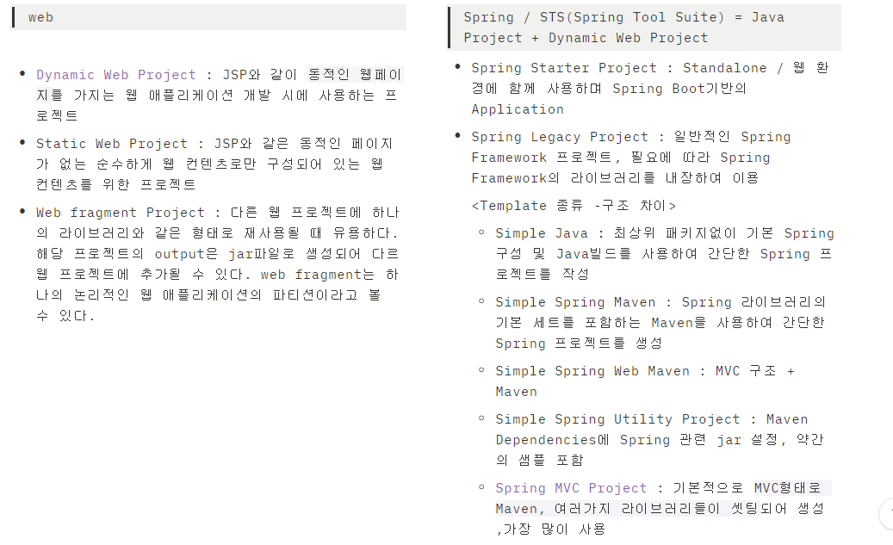
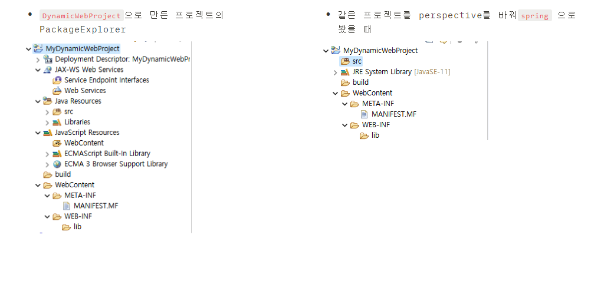
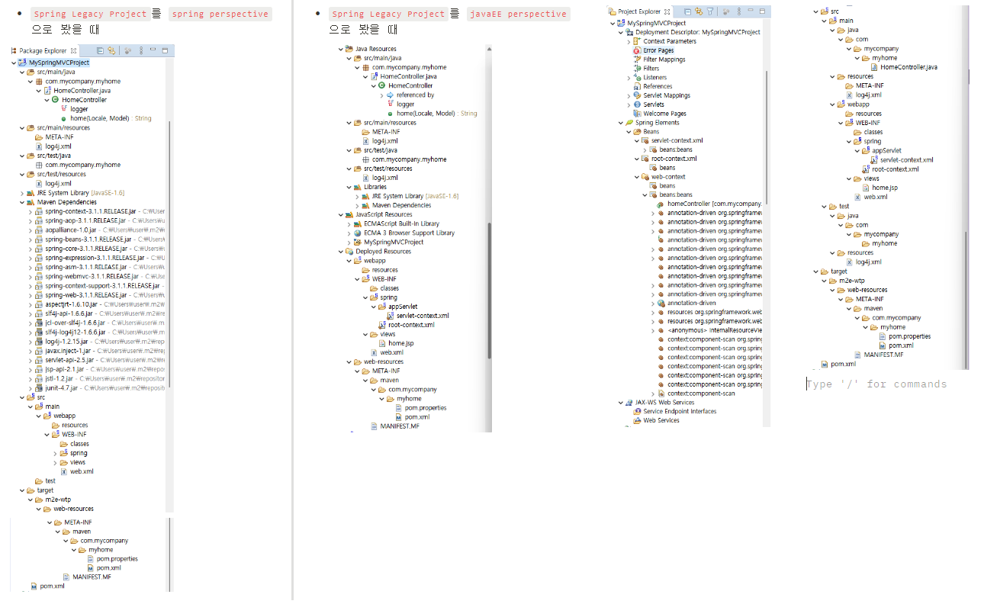

# 📋Dynamic web Project & Spring legacy Project 차이

`언제 어떤 거를 써야하지?` 			`Dynamic web Project`			`Spring legacy Project`			`웹프로젝트종류`

* ‼️ 스프링 공부중 HOW랑 WHY가 정리가 안돼서 정리해봄

---

### 1. 참고

* Dynamic web Project ➡️ 일반 웹어플리케이션 구조

* Spring legacy Project ➡️ 스프링프로젝트 구조 (웹 +maven)

  

* Spring MVC Project(약 47바이트)가 Simple Spring Web Maven(약 15바이트)에 비해 용량이 2.5배 이상 더 나감

​	[Dynamic web Project & Spring legacy Project 차이](https://velog.io/@dhffkvm_718/Dynamic-web-Project-Spring-legacy-Project-%EC%B0%A8%EC%9D%B4)

​	[이클립스 프로젝트 종류와 차이](https://deeds-not-words.tistory.com/entry/%EC%9D%B4%ED%81%B4%EB%A6%BD%EC%8A%A4-%ED%94%84%EB%A1%9C%EC%A0%9D%ED%8A%B8-%EC%A2%85%EB%A5%98%EC%99%80-%EC%B0%A8%EC%9D%B4)

---

### 2. 😅TMI 😅일단 화면 구성 상 차이를 보자면...

* `Dynamic Web Project` ➡️ javaEE로 봤을 떄 상세히 나와서 보기 좋음
* jsp와 필요한 라이브러리들 수동으로 달아줘야함

---

* `Spring Legacy Project` ➡️ javaEE로 봤을 떄 폴더 속에 폴더가 너무 많아서 어지러움. 확실히 Spring으로 봤을 때 덜 지저분함
* maven dependency로 필요한 라이브러리가 새팅돼서 나옴

