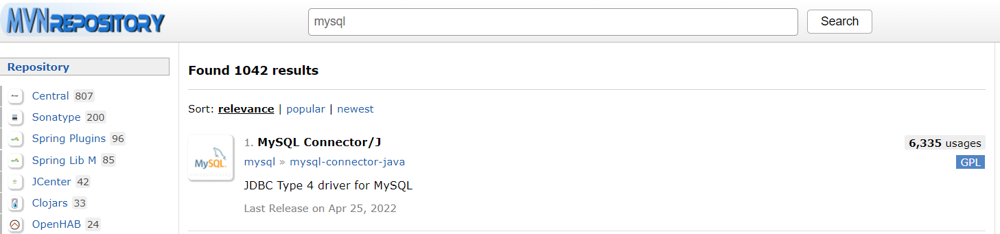
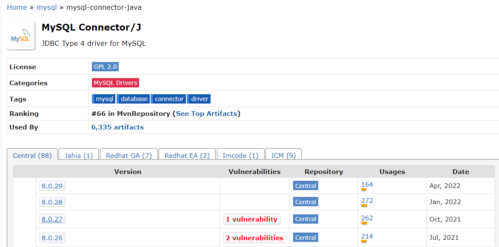
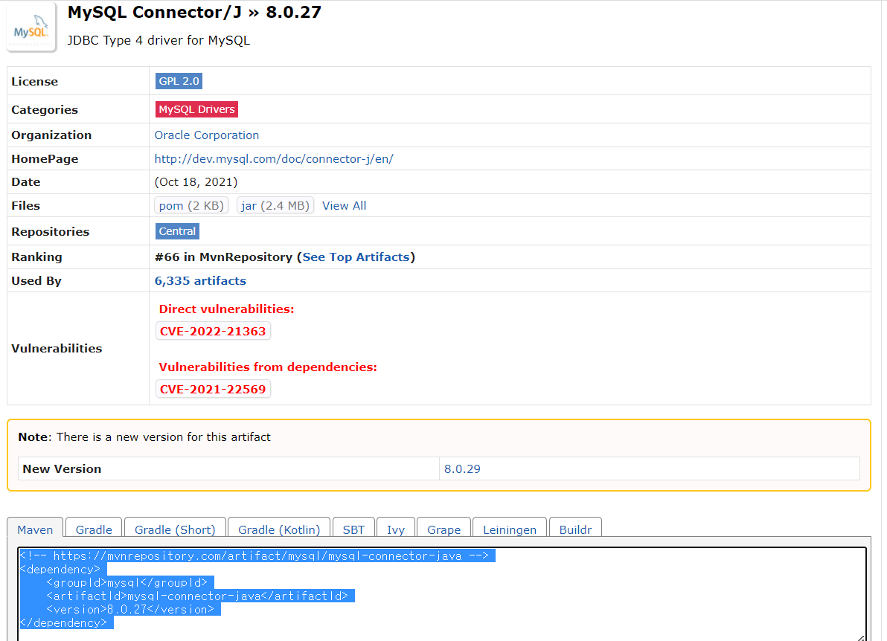
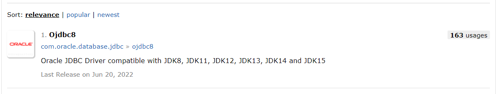
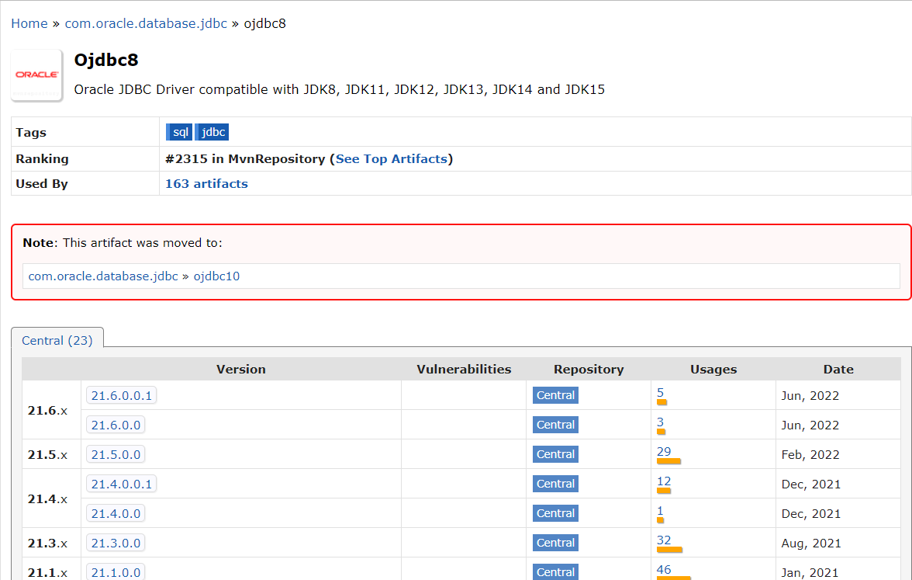
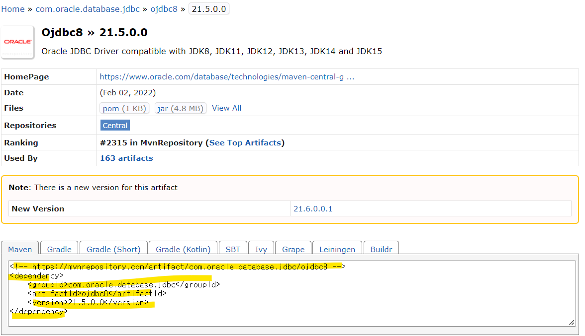

# Maven Repositories

* 데이터베이스 연동 해주기

  * mySQL

    

* 위의 부분을 pom.xml ➡️dependencies 안으로 복붙해주면 끝

* oracle database 도 마찬가지

  

* references & sources

[Maven Repository](https://www.tutorialspoint.com/maven/maven_repositories.htm)

[MVN REPOSITORY](https://mvnrepository.com/)