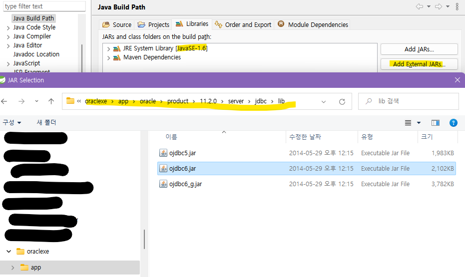

# 📋자바와 오라클 연동하기 : ojdbc6.jar 위치

`jdbc 드라이버` `ojdbc6.jar`

* JDBC란? JVM의 시스템과 DB시스템을 연결 통신하기 위한 JAVA 표준 스펙

* ojdbc8.jar = jdk 1.6이상 버전용
* buildpath해서 연동해야하는데 드라이버의 위치가 익숙해지기 전까지 헤매는 걸 방지하기 위해 정리함

* [참고블로그](https://all-record.tistory.com/69)