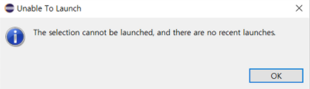

### 자바 Unable To launch 오류 🤖‼️

리포지터리를 클론한 후 이클립스를 실핼하려는 도중

`The selection cannot be launched, and there are no recent launches.`

오류가 뜸.

[해결방안 링크 1](https://mozi.tistory.com/554)

발생 원인: 실행모드가 저장 되지 않아서라고 함

해결 방안: Windows ▶️ Preferences ▶️ Run/Debug ▶️ Launching
▶️ Launch Operation ▶️ Launch the aselected resource or active editor if not launchable
✅ Launch the associated project
🟩 Lanch the previouly launched application
▶️ Apply and Close

`🟩 Launch the previouly launched application`
: 이전 프로그램 실행하겠다

[해결방안 링크 2](https://it-learn.tistory.com/16)
